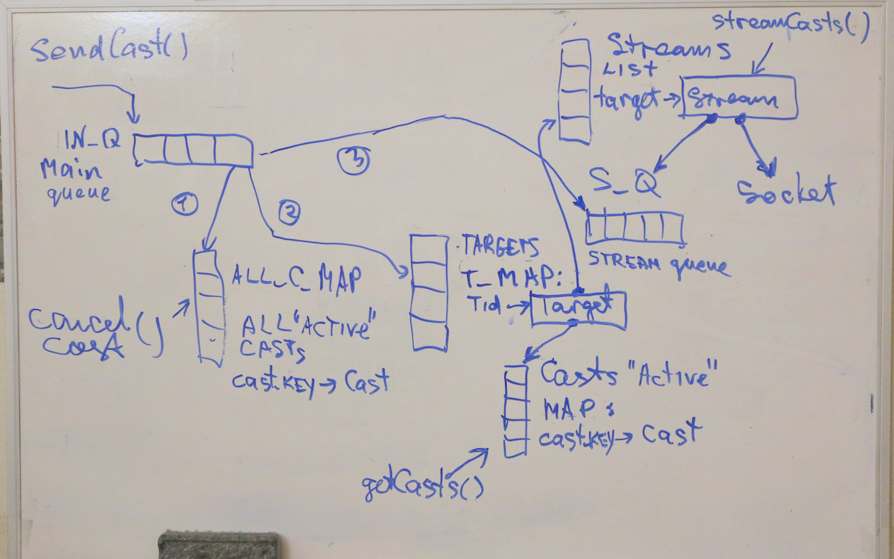

# CastService
See the problem description for CastService functional spec. 
This service implementation uses RMI for service calls and TCP socket for streaming of serialized [Cast](https://github.com/dkhokhlov/CastService/blob/main/src/main/java/castservice/Cast.java) objects.

## Design Notes

* Remote interface is defined in ("code first"): 
[castservice.ICastService](https://github.com/dkhokhlov/CastService/blob/main/src/main/java/castservice/ICastService.java)



* [Class Diagram](class_diagram.pdf)
* collection containers are thread safe, concurrent versions: **LinkedBlockingQueue, ConcurrentHashMap, CopyOnWriteArrayList**
* Threads (except main): 
  - "Incoming queue loop" 1,2,3 on block diagram, in CastService
  - "Steam loop", in Stream  

## To-Do
- extract test cases from Client to test classes
- add getters/setters
- refine preperties visibilities
- mode javadocs 

## Build
- uses maven and JDK 1.8
```
./mk
```

## Run standalone service

```
$ ./mk.run
CastService v1.0.0
Ready

$ ps aux | grep com.trumid.castservice.Main
owner    10612 12.0  0.2 7213088 33752 pts/4   Sl+  19:12   0:00 java castservice.Main
```

## Run Demo client

```
./mk.client localhost
```

## Call Stats
- 0.372 ms per sendCast()
- 0.136 ms per cancelCast()
- 0.294 ms per getActiveCasts()

## Terminate standalone service

1) Send TERM signal

```
$ kill -term 10612
```

2) Send Ctrl-C to running app
```
^C
ShutdownHook called!
shutdown() called...
Exiting...
130
```

## Debug

1) Logging goes to stdout 

2) Prints stack trace to stderr:

```
$ kill -quit 10612
```

3) Run with debugger enabled waiting for attach
```
$ ./mk.run.debug
```

## Life cycle
- needs to be restarted at EOD to clean accumulated books
